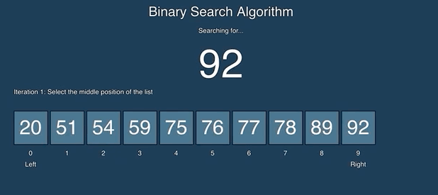

---
<h1>
Algoritmo de Busqueda Binaria
</h1>

---

| [Definicion](#definicion) | [Utilizacion](#utilizacion) | [Pseudocódigo](#pseudocódigo) | [Tiempo De Ejecucion](#tiempo-de-ejecución-de-la-búsqueda-binaria) |
|-|-|-|-|

---

## Definicion

La **búsqueda binaria** es un algoritmo eficiente para encontrar un elemento específico en una lista **ordenada** de elementos. Utiliza una estrategia de búsqueda de **"divide y vencerás"** para reducir la cantidad de elementos que debe revisar, **dividiendo** la lista a la **mitad** en cada iteración. Es uno de los algoritmos de búsqueda más rápidos y eficientes disponibles. 

---
## Utilizacion

El algoritmo de búsqueda binaria se utiliza comúnmente para encontrar elementos en un conjunto de datos ordenados como **listas**, **arreglos** o **matrices ordenadas**. También se utiliza para realizar búsquedas en bases de datos y para encontrar el elemento más próximo a un número dado en un conjunto de números.
Tomemos de ejemplo el catálogo estelar Tycho-2 una base de datos que contiene la posición, la magnitud y la clase espectral de más de 2.5 millones de estrellas. Supongamos que queremos buscar en el catálogo una estrella en particular, con base en el nombre de la estrella. Si el programa examinara cada estrella en el catálogo estelar en orden empezando con la primera, con un algoritmo llamado búsqueda lineal, la computadora podría, en el peor de los casos, tener que examinar todas las 2.5 millones de estrellas para encontrar la estrella que estás buscando. Si el catálogo estuviera ordenado alfabéticamente por nombres de estrellas, la búsqueda binaria no tendría que examinar más de 22 estrellas, incluso en el peor de los casos.

---

## Pseudocódigo

1. Ordenar los elementos si no se encuentran ordenados. El algoritmo de búsqueda binaria requiere que los elementos estén ordenados de forma ascendente.
2. Definir el rango de búsqueda estableciendo los límites izquierdo y derecho como un conjunto de elementos en los que se realizará la búsqueda.
3. Calcular el punto medio. Esto se realiza dividiendo el número de elementos del rango por la mitad. 
4. Comparar el elemento en el punto medio con el elemento que se está buscando.
5. Si el elemento es igual al elemento que se está buscando, se ha encontrado el elemento
6. Si el elemento es mayor, el elemento buscado debe estar en el rango inferior. Establecer el límite derecho como el punto medio - 1.
7. Si el elemento es menor, el elemento buscado debe estar en el rango superior.Establecer el límite izquierdo como el punto medio + 1.
8. Si el elemento buscado se encuentra, devolver su índice.
9.  Si el límite derecho es menor que el limite izquierdo, entonces no está en el array. Regresa -1.
10. Repetir los pasos 2 a 9 hasta que el elemento buscado sea encontrado o el límite derecho sea menor que el limite izquierdo.

---

## Tiempo de ejecución de la búsqueda binaria
La búsqueda binaria es un algoritmo de búsqueda de complejidad $O(log$ $n)$. Esto significa que el número de pasos requeridos para encontrar un elemento en una lista aumenta a medida que el número de elementos en la lista aumenta, pero no lo hace en la misma proporción. Por lo tanto, el tiempo de ejecución de la búsqueda binaria es mucho más rápido que el tiempo de ejecución de un algoritmo de búsqueda lineal, en el que el tiempo de búsqueda aumenta linealmente con el número de elementos en la lista.

La clave de la eficiencia del algoritmo de busqueda binaria es que cuando el algoritmo realiza una busqueda incorrecta, el intervalo del arreglo que contiene los intentos razonables se reduce a la mitad. Si la porción razonable tenía $40$ elementos, entonces un intento incorrecto la reduce para que tenga $20$. La búsqueda binaria reduce el tamaño de la porción razonable a la mitad después de cada intento incorrecto.

Cada vez que duplicamos el tamaño del arreglo, un intento más. Suponiendo que necesitamos $m$ intentos para un arreglo de longitud $n$. Entonces, para un arreglo de longitud $2n$, el primer intento corta la porción razonable del arreglo a un tamaño $n$, y como maximo en $m$ intentos terminamos, dándonos un total $m+1$ intentos.

Hay una función matemática que significa lo mismo que el número de veces que dividimos repetidamente a la mitad, empezando en $n$, hasta obtener el valor de $1$: el logaritmo base $2$ de $n$. Eso suele escribirse como $log_2$ $n$, pero tambien se puede encontrar con la notacion de $lg$ $n$.

|   $n$         |    $Log_2$ $n$    |
|---------------|-------------------|
|   1           |        0          |
|   2           |        1          |
|   4           |        2          |
|   8           |        3          |
|   16          |        4          |
|   32          |        5          |
|   64          |        6          |
|   128         |        7          |
|   256         |        8          |
|   512         |        9          |
|   1024        |        10         |
|   1,048,576   |        20         |
|   2,097,152   |        21         |

#
#### Grafica de la funcion logaritmica

La función logaritmo crece muy lentamente. Los logaritmos son los inversos de las exponenciales, que crecen muy rápidamente, de modo que si $log_2$ $n$ $=x$, entonces $n$ $=2^x$. Por ejemplo, $log_2$ $128$ $=7$ podemos deducir que $2^7$ $=128$ 

Eso facilita calcular el tiempo de ejecución de un algoritmo de búsqueda binaria en una $n$ que es exactamente una potencia de 2. SI $n$ es $128$, la búsqueda binaria a lo más requerirá de 8 $( log_2 128 + 1 )$ intentos.

¿Qué pasa si $n$ no es una potencia de $2$? En ese caso podemos fijarnos en la potencia de $2$ que sea más cercana por abajo. 
Para un arreglo cuya longitud sea de $1000$, la potencia de $2$ más cercana por abajo es $512$, que es igual a $2^9$. Así que podemos estimar que $log_2$ $1000$ es un número mayor que 9 y menor que $10$, o usar una calculadora para ver que es aproximadamente $9.97$. Sumarle uno a eso nos da aproximadamente $10.97$. En caso de obtener un número decimal, redondeamos hacia abajo para encontrar el número real de intentos. Por lo tanto, para un arreglo de $1000$ elementos, una búsqueda binaria requeriría como maximo $10$ intentos.

Para la base de datos del **Tycho-2** con $2,539,913$ estrellas, la potencia de $2$ más cercana por abajo es $2^21$ (que es $2,097,152$), así que a lo más necesitaríamos 22 intentos, logrando asi una eficiencia mucho mayor que si lo hubieramos realizado con la busqueda lineal.
#
#### Grafica de la funcion lineal vs logaritmica

---

| [@ByDanielSan](https://github.com/kaiserkey) |
| - |

